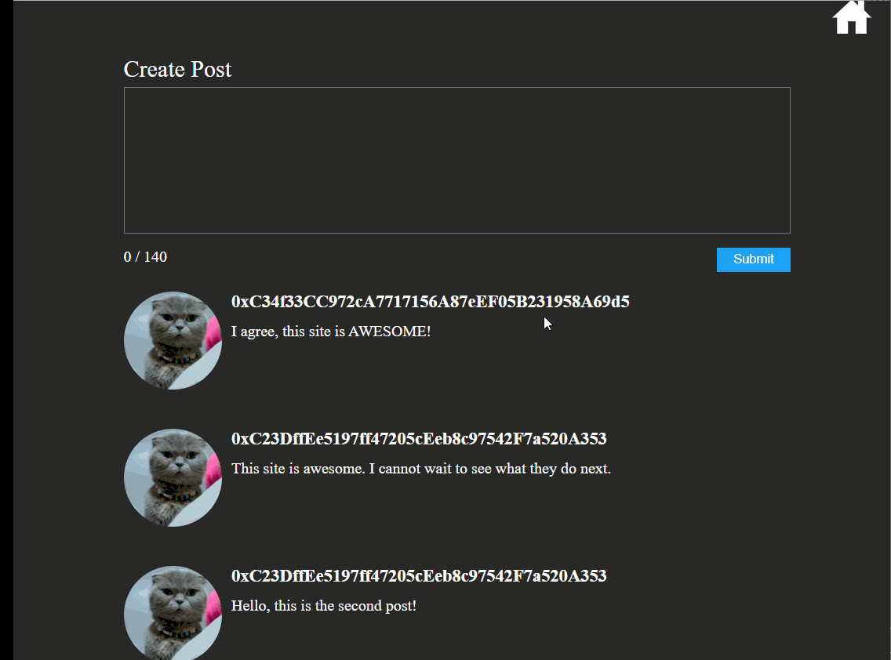

# Decentralized Twitter

## Description

This project contains the implementation for a "Decentralized Twitter" --
**a "bare bones"/minimal implementation**.

The app allows a user to:

* Create an Account
  * Basic account: The app stores the user address as the username and uses a default pic for profile
* Create a Post
  * Text only post, 140 characters or less
* View Posts
  * `/home` route: All posts in the system, ordered by most recent
  * `/profile` route: All posts for a specific user in the system, ordered by most recent

**Note: Link to the project will be shared within the next few weeks, so that you can try out the app.**

## Project Architecture

### Technology Stack Overview

* IPFS/OrbitDB
* Blockchain - Ganache (local environment)
* React
* Solidity

### Directory Structure

_Note: Only the main ones are highlighted below._

* `./client`: Home for the front-end application
* `./test`: Tests for the `DecentralizedTwitter` smart contract
* `./contracts`: Home of the `DecentralizedTwitter` smart contract 

### Data Storage

* IPFS/Orbit DB: Store actual data for the user and the post.  See next point for why I say actual.
* Blockchain (i.e. Ganache): Store references to data entries in Orbit DB.  Essentially, I store metadata on 
  the blockchain.  Specifically, for the user, their ID is stored on the blockchain, and a post, the reference
  to the post (i.e. post ID and user ID for author) is stored.  This is key, as the actual content for a post
  is not stored on the blockchain, but a reference to it.

### CRUD Operation Overview

In general, the philosophy for keeping the app as decentralized as possible is: **Treating the blockchain
as the source of truth.**

As an example, when the user wants to get all of the posts for the home page, here is the flow:

1. App Talks To Blockchain: It gets all of the posts in the system.  Remember, it does not get the actual
   content, but rather, metadata/references to the content.
2. App Talks To OrbitDB: It talks to Orbit DB, and essentially says, "I have all of these ID's from the
   blockchain.  Give me the posts with these IDs".
3. App Puts Data Together: From Orbit DB, the app gets the actual content and puts that together to
   get the actual content on the screen.

### Production Readiness

#### Error Handling

Technically, errors are not handled how they would be handled in production -- they're not really handled
at all.  The reason for this is that the project was just meant to address the ideal use case
(i.e. user has metamask, has some ETH).

#### localhost

You'll notice within the `client` source that `localhost` is hardcoded for the `IPFS` client.